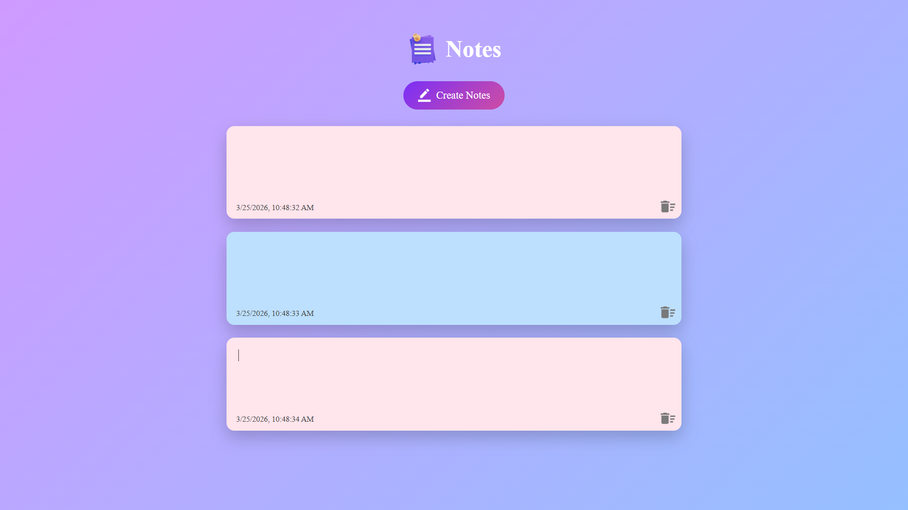

# 📝 Notes App

A simple and elegant **Notes App** built using **HTML, CSS, and JavaScript**.
This app allows users to create, edit, and delete notes with automatic saving using **localStorage**.    

---

## 🚀 Features

*  Create and edit notes dynamically
*  Auto-save notes using browser localStorage
*  Delete notes instantly
*  Random background colors for each note
*  Timestamp (date & time) for every note
*  Responsive and clean UI
*  Fast and lightweight (no frameworks used)

---

## 🛠️ Tech Stack

* **HTML5**
* **CSS3**
* **JavaScript**

---

## 🧠 How It Works

* Notes are created dynamically using JavaScript DOM manipulation
* Each note contains:

  * Editable text area
  * Timestamp
  * Delete button
* All notes are stored in **localStorage** as HTML
* On reload, notes are restored automatically

---

## 📸 Screenshots

